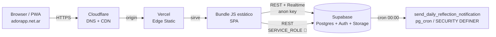

# 02 — Mapa del proyecto AdorAPP

## Resumen en 5 líneas

AdorAPP es una PWA en React/Vite para gestionar el ministerio de adoración del Centro de Avivamiento Familiar (CAF), con ~8 usuarios reales hoy. Permite a pastores y líderes armar órdenes de servicio (canciones + director + tono por canción), mantener un repertorio de canciones con acordes y transposición en vivo, gestionar bandas y miembros, aprobar solicitudes de registro y enviar comunicaciones. Usa Supabase para todo el backend (Auth, Postgres, Storage de avatares) y se hostea en Vercel detrás del dominio `adorapp.net.ar`. Todo el "backend" actualmente vive en el navegador del cliente, que se conecta directo a Supabase con dos clientes: uno con la `anon` key (legítimo) y otro con la `service_role` key (problema crítico). El sistema está en producción real, lo usan personas todos los días, pero arrastra deuda técnica grande del agente anterior.

## Stack y versiones

| Capa | Tecnología | Versión |
|---|---|---|
| Build / dev server | Vite | 5.4.21 |
| UI framework | React | 18.3.1 |
| Routing | react-router-dom | 6.30.3 |
| State | Zustand | 4.5.7 |
| Styling | Tailwind CSS | 3.4.19 |
| Iconos | lucide-react | 0.294.0 |
| PDF | jspdf | 2.5.1 |
| UUID | uuid | 10.0.0 |
| Supabase SDK | @supabase/supabase-js | 2.45.x |
| Postcss / Autoprefixer | latest | — |
| Hosting | Vercel | — (proyecto `adorapp`, equipo `pabloeacus-projects`, region `iad1`) |
| Backend | Supabase | proyecto `gvsoexomzfaimagnaqzm`, Postgres major v17 (config local) |
| DNS / CDN | Cloudflare | (no auditado todavía) |
| Registro de dominio | nic.ar | (no auditado todavía) |
| Repo | GitHub | `pabloeacu/adorapp` (PÚBLICO) |
| CI/CD | Vercel auto-deploy desde `main` | sin GitHub Actions, sin tests |

## Arquitectura



El recuadro 🚨 es la vulnerabilidad descrita en `00_EMERGENCY.md`. En producción, la `service_role` viaja con el bundle JS al navegador.

## Estructura de carpetas (relevante)

```
adorapp/
├── src/
│   ├── App.jsx                  # Router + RouteSync + auto-refresh
│   ├── main.jsx                 # Entry point
│   ├── index.css                # Tailwind base + animaciones custom
│   ├── components/
│   │   ├── layout/
│   │   │   ├── Layout.jsx       # 51 líneas. Auth guard + responsive shell
│   │   │   ├── Sidebar.jsx      # 80. Desktop nav
│   │   │   ├── MobileNav.jsx    # 1242. Mobile header + bottom tabs + profile sheet + photo cropper + notifications
│   │   │   └── Header.jsx       # 1712. Desktop header con todas las cosas anteriores. Hay duplicación grande con MobileNav.
│   │   └── ui/
│   │       ├── Avatar.jsx       # 54
│   │       ├── Badge.jsx        # 28
│   │       ├── Button.jsx       # 37
│   │       ├── Card.jsx         # 30
│   │       ├── ConfirmModal.jsx # 158 (Confirm + Success + Error)
│   │       ├── Input.jsx        # 32
│   │       └── Modal.jsx        # 65
│   ├── pages/
│   │   ├── Dashboard.jsx        # 184
│   │   ├── Login.jsx            # 522 (incluye RegisterModal)
│   │   ├── Ordenes.jsx          # 1297
│   │   ├── Repertorio.jsx       # 1327
│   │   ├── Bandas.jsx           # 454
│   │   ├── Miembros.jsx         # 1058
│   │   ├── Solicitudes.jsx      # 633
│   │   └── Comunicaciones.jsx   # 642
│   ├── stores/
│   │   ├── authStore.js         # Zustand: user/profile/login/logout/signUp/refreshProfile
│   │   └── appStore.js          # Zustand: members/bands/songs/orders + transposeSongStructure + autoRefresh
│   ├── lib/
│   │   ├── supabase.js          # 🚨 service_role hardcoded
│   │   └── useAuth.js           # Hook viejo, no usado. Código muerto.
│   └── data/
│       └── sampleData.js        # (a confirmar uso)
├── public/
│   ├── manifest.json            # PWA, 192/512 con misma imagen, no hay icons reales por tamaño
│   ├── adorapp-logo.png         # icon
│   ├── adoracion-caf-logo*.png  # branding
│   ├── logo*.png                # branding
│   └── login-bg.jpg
├── supabase/
│   ├── config.toml              # Configuración local de supabase CLI
│   └── migrations/
│       ├── 20240101000000_add_profile_fields.sql
│       ├── 20260414_create_song_key_history.sql
│       ├── 20260421_add_member_editor.sql
│       ├── 20260421_add_song_compass_bpm.sql
│       ├── 20260423_fix_song_key_history_rls.sql
│       ├── 20260427_create_daily_reflections_and_notifications.sql
│       └── 20260427_create_daily_notification_function.sql
├── vercel.json                  # SPA rewrites + 2 headers básicos
├── vite.config.cjs              # plugin react + base './'
├── tailwind.config.js
├── postcss.config.js
├── package.json                 # scripts: dev, build (NO test, NO lint, NO typecheck)
├── index.html                   # Meta PWA + favicons + Inter de Google Fonts
├── .env.local                   # solo VERCEL_OIDC_TOKEN (rotativo)
├── .gitignore                   # OK, excluye .env*, node_modules, dist, .vercel
└── AUDIT/                       # ← creado por mí (Claude) hoy
```

### Archivos huérfanos / a borrar (del agente anterior)

En el root del repo (no de `/Users/paulair/Desktop/Adorapp/`, sino del repo `adorapp/`) hay decenas de archivos sueltos: `audit_db.cjs`, `audit_security.cjs`, `connect_db.cjs`, `auto_fix.cjs`, `check_*.{js,cjs}`, `diagnose_*.{js,cjs}`, `verify_*.{js,cjs}`, `fix_*.{js,cjs,sql}`, `CLEAN_SQL_FIX.sql`, `DEFINITIVE_FIX_RLS.sql`, `DIAGNOSE_RLS.sql`, `FINAL_*`, `ULTIMATE_FIX.sql`, `SUPER_RESET_RLS.sql`, `SIMPLE_FIX_RLS.sql`, `FIX_EXISTING_USERS.sql`, `FIX_SECURITY_VULNERABILITIES.sql`, `add_categories_column.sql`, `daily_reflections_inserts.sql` (93KB), `dist-preview.html`, `preview-login.html`, etc.

Y en la carpeta padre `/Users/paulair/Desktop/Adorapp/`: `check_and_notify.py`, `fix_rls.sql`, `generate_sql.py`, `read_excel*.py`, `preview-login/`, `user_input_files/` (con 51 archivos del usuario, parecen brand assets/inputs originales).

Ninguno de estos es ejecutado por la app o por CI. Son scratch del agente anterior. La auditoría debería terminar con un PR `chore/cleanup` que los borre o los mueva a `/archive/`.

## Modelo de datos (real, según código + migrations)

### Tablas core

| Tabla | Propósito | RLS hoy |
|---|---|---|
| `members` | Personas del ministerio (FK opcional a `auth.users`) | `USING (true)` para authenticated |
| `bands` | Equipos de adoración (members[] como UUID array) | `USING (true)` para authenticated |
| `songs` | Repertorio con structure JSONB de secciones + acordes | `USING (true)` para authenticated |
| `orders` | Órdenes de servicio (songs JSONB con songId/directorId/key) | `USING (true)` para authenticated |
| `pending_registrations` | Solicitudes con password en cleartext 🚨 | INSERT anon, resto authenticated |
| `daily_reflections` | 365 reflexiones diarias precargadas | SELECT autenticados |
| `notifications` | Bell con globales + personales | SELECT propio + globales, UPDATE propio |
| `communications` | Mensajes que mandan los pastores | SELECT autenticados, INSERT autenticados (luego se pasó a permissive) |
| `communication_notifications` | Per-recipient view de communications | UPDATE/SELECT propio |
| `song_key_history` | Tono histórico por miembro × canción | SELECT/INSERT/UPDATE/DELETE con check de membership |

### Storage

- Bucket `avatars` — público lectura, autenticado escritura. Path: `avatars/{userId}-{timestamp}.png`. Procesado en cliente con canvas (200x200 → 400x400).

### Funciones / triggers

- `update_updated_at_column()` — trigger BEFORE UPDATE en members, bands, songs, orders, pending_registrations. Pone `updated_at = NOW()`.
- `send_daily_reflection_notification()` — `SECURITY DEFINER`, ejecutable por anon y authenticated. La idea es correrla por pg_cron a las 00:00. **Debería revisarse si pg_cron está realmente configurado** (no lo veo en migrations).

## Features implementadas

1. **Auth** — login email/pass, logout completo, reset password (link rota a `/reset-password` que no existe)
2. **Dashboard** — 4 stats cards + canciones recientes + próximas órdenes + miembros con instrumentos
3. **Órdenes de servicio** — CRUD, asignar director y tono por canción, history de tonos por miembro/canción, devolución del pastor, exportar a PDF (resumen) e imprimir canciones (con acordes transpuestos)
4. **Repertorio** — CRUD canciones con title/artist/originalKey/categories[]/youtubeUrl/structure[]/compass/bpm, transposición en vivo, vista cards/tabla, filtro por categorías y "sin usar últimas N semanas", export PDF
5. **Bandas** — CRUD con miembros asignados y tipo/día/hora de reunión
6. **Miembros** — CRUD con avatar (con cropper en cliente), reset de password, eliminación permanente, soft-delete, permisos especiales (editor)
7. **Solicitudes** — bandeja de pending_registrations con aprobar (asignar rol) / rechazar
8. **Comunicaciones** — pastor manda mensajes a bandas / users / roles / all, queda en bell de cada usuario
9. **Notificaciones** — bell con songs nuevos, requests pendientes (pastors), reflexión diaria global, communications personales, marca como leído per-user en localStorage
10. **PWA** — manifest, apple-touch-icons, standalone display, auto-refresh en background

## Riesgos identificados a primera vista (resumen, detalle en `00_EMERGENCY.md`)

🚨 **Críticos**
- Service role key en bundle público
- Passwords en cleartext en `pending_registrations`
- RLS sin granularidad de rol + signup público abierto

⚠️ **Altos**
- Sin enforcement backend de rol (frontend-only)
- localStorage retiene datos sensibles post-logout
- Doc commiteada con secrets (PROJECT_DOCUMENTATION.md)
- Sin tests, sin lint, sin typecheck en CI
- Sin protección de rate limiting custom

🟡 **Medios**
- Auto-sync agresivo (30s) → cuota Supabase
- 2 paths de signup paralelos (uno bypassable)
- Header.jsx 1712 líneas + duplicación con MobileNav.jsx 1242 líneas
- Algunas páginas >1000 líneas (Repertorio, Ordenes, Miembros)
- Decenas de archivos huérfanos en root
- `console.log` masivos de debug en prod
- Headers HTTP escasos en `vercel.json` (falta CSP, HSTS, Referrer-Policy, Permissions-Policy)
- Ruta `/reset-password` no existe pero el email la referencia

🔵 **Bajos / nice-to-have**
- PWA usa misma imagen para 192 y 512 (debería tener iconos generados específicos)
- Manifest sin `screenshots` ni `categories`
- Sin dark/light theme switch (todo es dark)
- Sin i18n (hardcodeado en es-AR)
- Sin Sentry / error tracking
- Sin uptime monitoring

## Próximos pasos

1. Esperar OK del usuario sobre el plan de remediación de la emergencia
2. Si OK → ejecutar Pasos 1-4 del plan
3. Después de la remediación → Fase 2 (auditoría exhaustiva por dominio: code quality, performance, paridad mobile/desktop, a11y, SEO, devops)
4. Fase 3 (reporte consolidado con roadmap)
5. Fase 4 (implementación supervisada de fixes)
6. Fase 5 (documentación viva)
